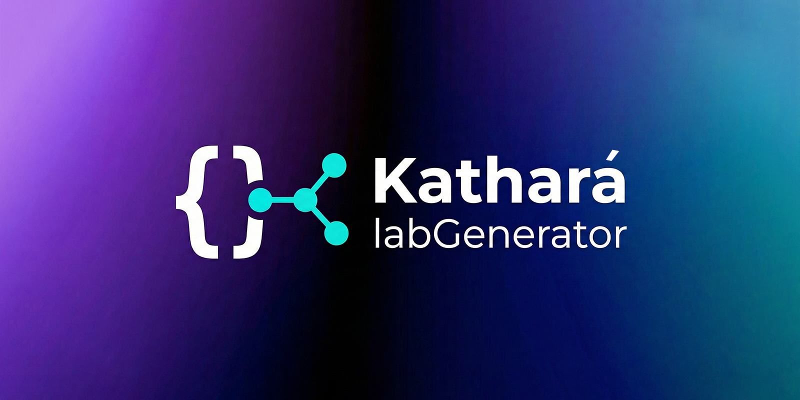
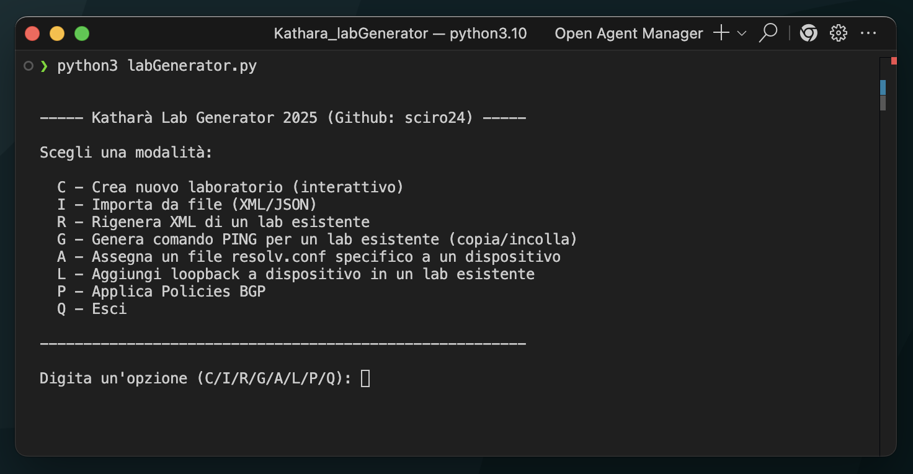
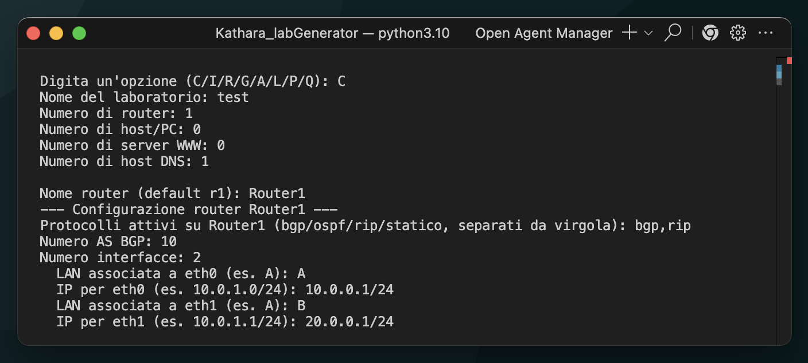
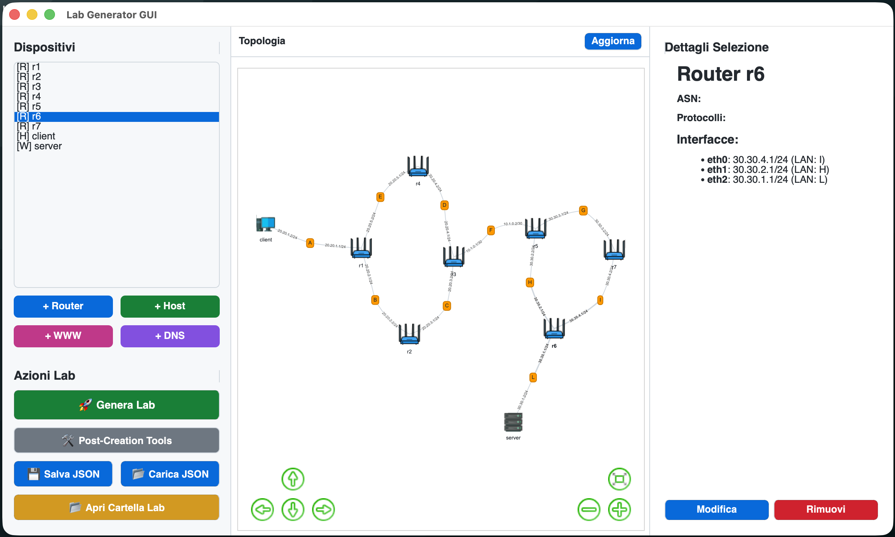

<div align="center">
  
  
  # Kathara Lab Generator
  
  **A comprehensive toolkit for automated network lab creation with Kathara**
  
  [](https://www.python.org/)
</div>

---

## Overview

This repository provides two powerful tools designed to streamline the creation of complex network topologies for [Kathara](https://www.kathara.org/), a container-based network emulation platform. Whether you prefer working in the terminal or through a modern graphical interface, these tools automate the tedious process of configuring routers, hosts, servers, and network protocols.

### What's Included

1. **`labGenerator.py`** - A feature-rich command-line interface (CLI) for step-by-step lab creation
2. **`labGenerator_GUI.py`** - A modern, intuitive graphical user interface (GUI) with real-time topology visualization

Both tools generate production-ready Kathara labs with properly configured:
- **FRR Routers** with BGP, OSPF, RIP, and static routing
- **Client Hosts** with network interfaces and default gateways
- **Web Servers** running Apache with customizable content
- **DNS Servers** using BIND9 (Root, Master, or Caching/Forwarding)

---

## 1. LabGenerator (CLI)

`labGenerator.py` is the core of the project. It is an interactive Python script that guides the user step-by-step through the creation of an entire network topology.

### How it works
The script asks the user to define network devices one by one. It supports:
- **FRR Routers**: Automatic configuration of daemons (zebra, bgpd, ospfd, ripd), interfaces, loopbacks, and routing protocols (BGP, OSPF, RIP, Static).
- **Client Hosts**: Simple PCs with IP and default gateway configuration.
- **Web Servers**: Apache servers with customizable index page.
- **DNS Servers**: BIND9 servers configurable as Root, Master, or Caching/Forwarding.

Once the devices are defined, the script automatically generates the folder structure, `.startup` files, `lab.conf`, and FRR daemon configurations. It also includes post-creation menus to refine the configuration (e.g., BGP policies, automatic neighbors).


| LabGenerator CLI Demo 1 | LabGenerator CLI Demo 2 |
| :---: | :---: |
|  |  |


---

## 2. LabGenerator GUI

`labGenerator_GUI.py` is a modern graphical interface based on PySide6 that makes creating labs even more intuitive and visual.

### Features
- **Topology Visualization**: An interactive graph shows connections between devices (Routers, Hosts, LANs) in real-time.
- **Guided Configuration**: Dedicated dialog windows for each device type allow entering parameters (IP, protocols, routes) without remembering the syntax.
- **Complete Management**: Allows saving, loading, and modifying existing labs.
- **Full Integration**: Uses the `labGenerator.py` engine to ensure the same quality and correctness of the generated files.


| LabGenerator GUI Demo 1 | LabGenerator GUI Demo 2 |
| :---: | :---: |
|  |  |


## Prerequisites and Installation

1. Ensure you have Python 3.8+ installed.
2. Create a virtual environment and install dependencies:

```bash
python3 -m venv .venv
source .venv/bin/activate
pip install -r requirements.txt
```

### Usage

For the GUI:
```bash
python3 labGenerator_GUI.py
```

For the CLI:
```bash
python3 labGenerator.py
```
